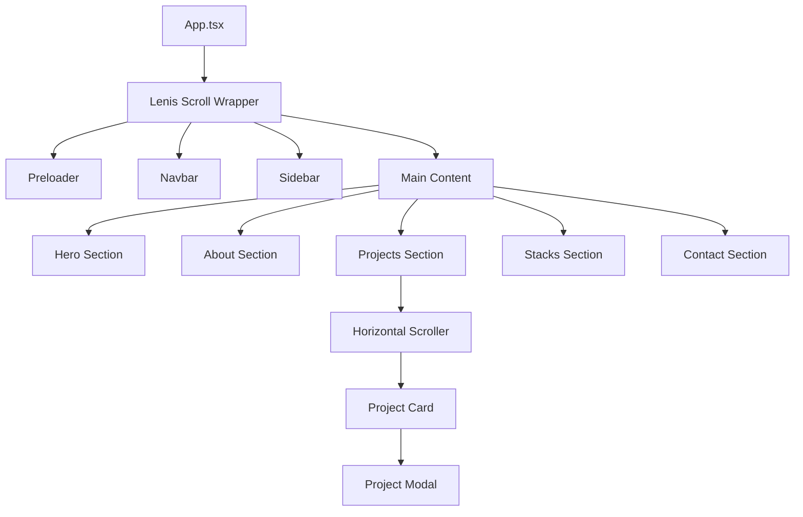

# Portfolio PH — Architecture

## Overview
SPA (Single Page Application) built with **Vite** and **React**, focused on high-performance animations and smooth navigation.

## Component Hierarchy

## Navigation Logic
- **Desktop (993px+):** Sidebar (core nav) + Header (external links).
- **Mobile (<992px):** Sidebar hidden + Header (Hamburger Menu with core nav).

## Animation Strategy
| Library | Scope | Implementation |
|---|---|---|
| **GSAP** | Scroll-driven events, complex timelines, parallax | `useGsap` custom hook with `ScrollTrigger` |
| **Framer Motion** | Modals, Hover effects, Micro-animations | `motion.div` for layout transitions |
| **Lenis** | Smooth scrolling | Global hook `useLenis` |

## Design Tokens
- **Primary:** `#ffffff` (text), `#b43232` (dead red accents)
- **Background:** `#050505` (deep black), `rgba(10, 10, 10, 0.8)` (glass)
- **Typography:** Inter (Body), Outfit (Display), JetBrains Mono (Technical)
